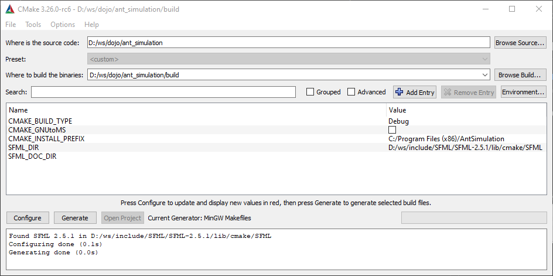

# Ant Simulation
Inspired by the [johnBuffer's](https://github.com/johnBuffer/AntSimulator) [AntSimulator](https://github.com/johnBuffer/).
This repo should not be a direct clone of the original repo, but a reimplementation of the original project in C++.

## Installation
### Requirements
- [CMake](https://cmake.org/)
- [SFML](https://www.sfml-dev.org/)

### Build
Run cmake with the following options:


Then go to the build directory and run make.
```bash
cd build
make
```